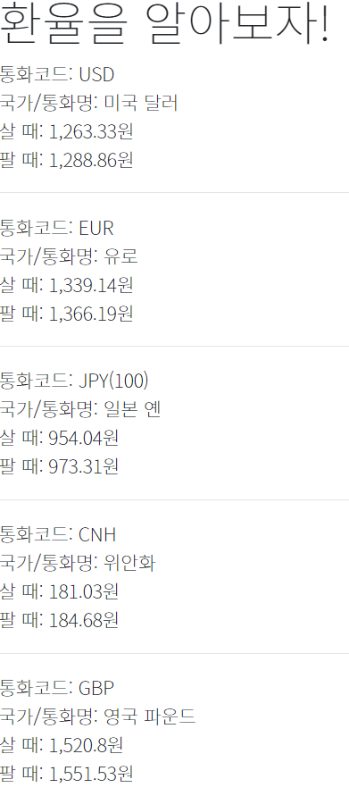

# 환율 API 활용

오늘 해볼 것은 환율 API 활용이다. 

이 예제 사용 시 다음과 같은 장점이 있다.

- 공공 API 사용법 익히기
- npm 라이브러리 적용 (dayjs, lodash)
- JS 파싱능력 향상
- 클라이언트 CORS 임시 해결법: 크롬 CORS 익스텐션 사용

사용한 공공 API: 한국수출입은행 환율정보

[https://www.koreaexim.go.kr/ir/HPHKIR020M01?apino=2&viewtype=C&searchselect=&searchword=](https://www.koreaexim.go.kr/ir/HPHKIR020M01?apino=2&viewtype=C&searchselect=&searchword=)

